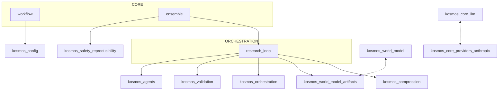
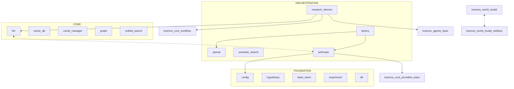

# Kosmos: Developer Warm Start

> Context-efficient onboarding guide for AI programmers.
> Generated: 2025-12-12 (Enhanced with Pydantic fields, decorators, line numbers)
> Codebase: 188 files, ~692K tokens (use X-Ray tools to stay under budget)

---

## 1. System Context

### Workflow-Centric View


### Full Architecture View


> Generated with: `python .claude/skills/kosmos-xray/scripts/dependency_graph.py kosmos/ --root kosmos --mermaid [--focus workflow]`

---

## 2. Architecture Overview

Kosmos is an autonomous scientific research framework that operates in iterative cycles:

**Hypothesis → Plan → Execute → Validate → Compress → Repeat**

Key architectural concepts:
- **Multi-agent coordination** via async message passing (AgentMessage, AgentRegistry)
- **Code sandbox** for safe execution (Docker isolation)
- **Knowledge graph** for persistent world model (Neo4j/SQLite)
- **Real-time streaming** via EventBus pub/sub pattern
- **Context compression** to manage token budgets across cycles

---

## 3. Critical Classes

### Entry Points
| Class | Location | Line | Purpose |
|-------|----------|------|---------|
| `ResearchWorkflow` | `kosmos/workflow/research_loop.py` | L32 | Main orchestrator - call `run()` |
| CLI | `kosmos/cli/main.py` | - | Command-line interface |
| API | `kosmos/api/` | - | REST/SSE/WebSocket endpoints |

### Core Components (with Pydantic Fields)

**BaseAgent** (`kosmos/agents/base.py:L97`)
```python
class BaseAgent:
    def __init__(agent_id, agent_type, config): ...  # L113
    def start(): ...  # L159
    def stop(): ...  # L177
    async def send_message(to_agent, content, message_type): ...  # L246
    async def receive_message(message): ...  # L329
    def execute(task) -> Dict: ...  # L485
```

**AgentMessage** (`kosmos/agents/base.py:L45`)
```python
class AgentMessage(BaseModel):
    id: str = Field(...)  # L60
    type: MessageType  # L61
    from_agent: str  # L62
    to_agent: str  # L63
    content: Dict[str, Any]  # L64
    correlation_id: Optional[str] = None  # L65
    timestamp: datetime  # L66
```

**Hypothesis** (`kosmos/models/hypothesis.py:L32`)
```python
class Hypothesis(BaseModel):
    id: Optional[str] = None  # L50
    research_question: str = Field(...)  # L51
    statement: str = Field(...)  # L52
    rationale: str = Field(...)  # L53
    status: HypothesisStatus  # L56
    testability_score: Optional[float]  # L59
    novelty_score: Optional[float]  # L60
```

### Execution Layer
| Class | Location | Line | Purpose |
|-------|----------|------|---------|
| `CodeExecutor` | `kosmos/execution/code_executor.py` | - | Run Python/R code |
| `RetryStrategy` | `kosmos/execution/retry_strategy.py` | - | Error recovery |
| `DockerSandbox` | `kosmos/sandbox/docker_sandbox.py` | - | Isolated execution |

### Foundation (Most Imported)
| Module | Imported By | Purpose |
|--------|-------------|---------|
| `kosmos.config` | 48 modules | Configuration management |
| `kosmos.models.hypothesis` | 26 modules | Core data model |
| `kosmos.literature.base_client` | 20 modules | Literature search base |
| `kosmos.core.llm` | 12 modules | LLM client abstraction |

---

## 4. Data Flow

```
User Query
    │
    ▼
[1] ResearchWorkflow.run(goal)                    # L32
    │
    ├──▶ [2] state_manager.get_cycle_context()
    │
    ├──▶ [3] plan_creator.create_plan(objective, context)
    │
    ├──▶ [4] novelty_detector.check_plan_novelty(plan)
    │
    ├──▶ [5] plan_reviewer.review_plan(plan, context)
    │         │
    │    [if approved]
    │         │
    ├──▶ [6] delegation_manager.execute_plan(plan)
    │         │
    │         └──▶ [7] agent.execute(task)        # L485
    │                   │
    │                   └──▶ [8] code_executor.execute(code)
    │                             │
    │                             └──▶ [9] sandbox.run(code)
    │
    ├──▶ [10] scholar_eval.evaluate_finding(result)
    │
    ├──▶ [11] state_manager.save_finding_artifact(finding)
    │
    └──▶ [12] context_compressor.compress_cycle_results()
              │
              ▼
         Next Cycle (repeat 1-12)
              │
              ▼
         Final Results + Discoveries
```

---

## 5. Entry Points

### CLI Commands
```bash
# Run research workflow
kosmos run "research objective" --cycles 5

# With streaming output
kosmos run "objective" --stream

# Health check
kosmos doctor

# Interactive mode
kosmos interactive
```

### Python API
```python
from kosmos.workflow import ResearchWorkflow

# Basic usage
workflow = ResearchWorkflow(
    research_objective="Investigate X",
    max_cycles=20
)
results = await workflow.run(num_cycles=5)

# Verified importable ✓
```

### Key Imports
```python
# Workflow
from kosmos.workflow import ResearchWorkflow

# Agents
from kosmos.agents.base import BaseAgent, AgentMessage, AgentState
from kosmos.agents.registry import AgentRegistry

# Models (Pydantic)
from kosmos.models.hypothesis import Hypothesis, HypothesisStatus
from kosmos.models.experiment import Experiment

# Configuration
from kosmos.config import KosmosConfig
```

---

## 6. Context Hazards

**DO NOT READ these directories/files** - they consume context without providing architectural insight:

### Large Data Directories
| Directory | Reason |
|-----------|--------|
| `artifacts/` | Runtime outputs, plots, logs |
| `data/` | Test datasets |
| `.literature_cache/` | Cached PDF content |
| `kosmos-reference/` | Reference PDFs |
| `logs/` | Execution logs |
| `archive/` | Archived documentation |

### Large Files (>10K tokens)
| File | Tokens | Use Skeleton Instead |
|------|--------|---------------------|
| `agents/research_director.py` | 21.3K | `skeleton.py --priority critical` |
| `workflow/ensemble.py` | 10.7K | `skeleton.py` |
| `execution/data_analysis.py` | 10.6K | `skeleton.py` |

### File Extensions to Skip
`.jsonl`, `.log`, `.pkl`, `.pickle`, `.pyc`, `.coverage`, `.sqlite`

---

## 7. Quick Verification

```bash
# Check system health
kosmos doctor

# Verify core imports
python -c "from kosmos.workflow import ResearchWorkflow; print('✓ Workflow')"
python -c "from kosmos.agents.base import BaseAgent; print('✓ BaseAgent')"
python -c "from kosmos.models.hypothesis import Hypothesis; print('✓ Hypothesis')"

# Run quick sanity tests
pytest tests/ -k "sanity" --tb=short -q

# Check database
python -c "from kosmos.db import get_engine; print('✓ DB')"
```

---

## 8. X-Ray Commands

Use these scripts to explore further without consuming full context:

```bash
# Map directory structure with token estimates
python .claude/skills/kosmos-xray/scripts/mapper.py kosmos/ --summary

# Extract class/method skeletons with LINE NUMBERS (75-95% token reduction)
python .claude/skills/kosmos-xray/scripts/skeleton.py kosmos/workflow/

# Filter by priority level (critical, high, medium, low)
python .claude/skills/kosmos-xray/scripts/skeleton.py kosmos/ --priority critical

# Analyze import dependencies
python .claude/skills/kosmos-xray/scripts/dependency_graph.py kosmos/ --root kosmos

# Generate Mermaid diagram for documentation
python .claude/skills/kosmos-xray/scripts/dependency_graph.py kosmos/ --root kosmos --mermaid

# Focus on specific area
python .claude/skills/kosmos-xray/scripts/dependency_graph.py kosmos/ --focus workflow
```

### Enhanced Skeleton Features
The skeleton output now includes:
- **Pydantic/dataclass fields** - `name: str = Field(...)` visible
- **Decorators** - `@tool`, `@dataclass`, `@agent.register`
- **Global constants** - `SYSTEM_PROMPT = "..."`, `CONFIG = {...}`
- **Line numbers** - `def method(): ...  # L42` for precise navigation

### Token Budget Reference
| Operation | Tokens | Use When |
|-----------|--------|----------|
| mapper.py --summary | ~500 | First exploration |
| skeleton.py (1 file) | ~200-500 | Understanding interface |
| skeleton.py --priority critical | ~5K | Core architecture |
| dependency_graph.py | ~3K | Import relationships |
| dependency_graph.py --mermaid | ~500 | Documentation diagrams |

---

## 9. Architectural Layers

Based on dependency analysis:

### Foundation (High reuse, few dependencies)
- `kosmos.config` (48 imports) - Configuration
- `kosmos.models.hypothesis` (26 imports) - Core data model
- `kosmos.core.events` - Event system
- `kosmos.core.providers.base` - LLM provider base

### Core (Balanced)
- `kosmos.core.llm` (12 imports) - LLM client
- `kosmos.knowledge.graph` - Knowledge graph
- `kosmos.world_model.interface` - World model

### Orchestration (Many imports, coordinates system)
- `kosmos.workflow.research_loop` - Main workflow
- `kosmos.agents.research_director` - Agent coordination
- `kosmos.orchestration.delegation` - Task dispatch

---

*Generated by kosmos_architect using enhanced kosmos-xray skill.*
*Features: Pydantic fields, decorators, line numbers, Mermaid diagrams*
*To refresh: `@kosmos_architect refresh`*
