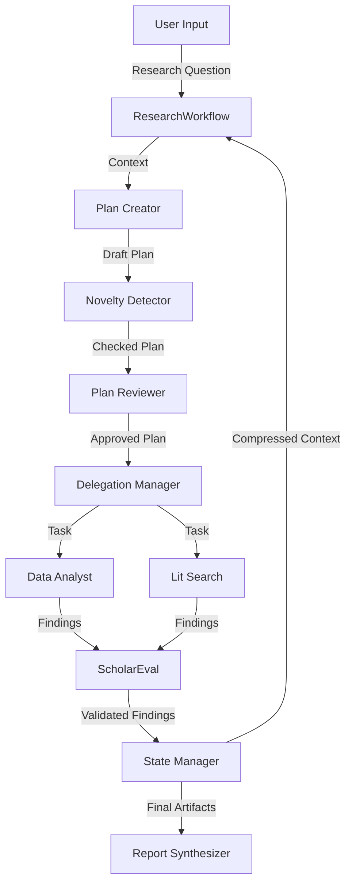

# Kosmos Operational Runbook

**Date**: 2025-11-22
**System**: Kosmos AI Scientist
**Version**: 1.0 (Integration Complete)

## 1. System Architecture Overview

Kosmos is an autonomous AI scientist system capable of conducting iterative research cycles. It uses a multi-agent orchestration pattern where parallel agents coordinate through a central State Manager.

### Core Components

The system consists of 6 primary components working in a cohesive loop:

1.  **Discovery Orchestrator** (`ResearchWorkflow` / `ResearchDirectorAgent`)
    *   **Role**: Manages the 20-cycle loop, coordinates task execution, and handles system state transitions.
    *   **Implementation**: `kosmos/workflow/research_loop.py` (Integration) & `kosmos/agents/research_director.py` (CLI Orchestrator).

2.  **State Manager (World Model)** (`ArtifactStateManager`)
    *   **Role**: The central knowledge repository. It maintains coherence across 200+ agent rollouts by storing findings, hypotheses, and evidence.
    *   **Implementation**: `kosmos/world_model/artifacts.py`. Uses a hybrid architecture (JSON Artifacts + Knowledge Graph + Vector Store).

3.  **Task Generator** (`PlanCreatorAgent`)
    *   **Role**: Strategic reasoning engine. Generates 10 prioritized tasks per cycle based on the current state.
    *   **Implementation**: `kosmos/orchestration/plan_creator.py`. Balances exploration vs. exploitation (70% exploration in early cycles, 30% in late cycles).

4.  **Data Analysis Agent** (`DataAnalystAgent` + `SkillLoader`)
    *   **Role**: Executes code in scientific domains. Uses 120+ domain-specific skills (e.g., `scanpy`, `pydeseq2`).
    *   **Implementation**: `kosmos/agents/data_analyst.py` & `kosmos/agents/skill_loader.py`.

5.  **Literature Search Agent** (`LiteratureSearchAgent`)
    *   **Role**: Searches and synthesizes scientific papers (PubMed, arXiv, Semantic Scholar).
    *   **Implementation**: Referenced in `kosmos/agents/literature.py` (conceptually), integrated via `DelegationManager`.

6.  **Report Synthesizer** (`ResearchWorkflow.generate_report`)
    *   **Role**: Consolidates validated findings into a final publication-quality report.
    *   **Implementation**: `kosmos/workflow/research_loop.py`.

### Data Flow



---

## 2. Research Cycle Lifecycle

A standard run consists of **20 iterations** (cycles). Each cycle follows these steps:

1.  **Context Building**: The `State Manager` retrieves recent findings (last 3 cycles), unsupported hypotheses, and valid discoveries. This context is compressed (20x reduction) via `ContextCompressor`.
2.  **Plan Creation**: `PlanCreatorAgent` generates 10 strategic tasks.
    *   **Exploration Ratio**: Adapts from 70% (cycles 1-7) to 30% (cycles 15-20).
    *   **Diversity**: Enforces mix of Data Analysis, Literature Review, and Hypothesis Generation.
3.  **Quality Assurance**:
    *   **Novelty Check**: `NoveltyDetector` compares tasks against past 200+ tasks to prevent redundancy.
    *   **Plan Review**: `PlanReviewerAgent` scores the plan on 5 dimensions (Specificity, Relevance, Novelty, Coverage, Feasibility). Must score ≥7.0/10 to proceed.
4.  **Execution**: `DelegationManager` executes tasks in parallel (up to 3 concurrent).
    *   **Task Routing**: Dispatches to appropriate agent (e.g., Data Analyst for code execution).
    *   **Skill Injection**: `SkillLoader` injects domain-specific API knowledge into prompts.
5.  **Validation**: `ScholarEvalValidator` scores each finding on 8 scientific dimensions (Rigor, Novelty, etc.). Only findings with score ≥0.75 are saved.
6.  **State Update**: Validated findings are stored as JSON artifacts and indexed in the Knowledge Graph.
7.  **Convergence Check**: System checks if research objective is met or max cycles reached.

---

## 3. Component Operations

| Component | Entry Point | Inputs | Outputs | Success Criteria | Failure Modes |
| :--- | :--- | :--- | :--- | :--- | :--- |
| **Research Workflow** | `ResearchWorkflow.run()` | Research Question, Max Cycles | Research Report, Artifacts | Completion of N cycles with validated findings | Timeout, Budget Exceeded |
| **Plan Creator** | `PlanCreatorAgent.create_plan()` | Context, Objective | 10 Strategic Tasks | Plan approval by Reviewer | API Error, Malformed JSON |
| **Delegation Manager** | `DelegationManager.execute_plan()` | Approved Plan | Task Results | >80% Task Success Rate | Agent Timeout, Execution Error |
| **Data Analyst** | `DataAnalystAgent.analyze()` | Task Description, Dataset | Analysis Result, Stats | Valid JSON with p-values/stats | Code Error, Library Missing |
| **ScholarEval** | `ScholarEvalValidator.evaluate_finding()` | Finding Dict | Score (0-1), Feedback | Score Generation | Validation Service Down |
| **State Manager** | `ArtifactStateManager.save_finding_artifact()` | Finding Data | JSON File, Graph Node | File created, Graph updated | Disk Full, DB Connection Error |

---

## 4. Step-by-Step E2E Flow

### Recommended Execution Method

Due to a known issue with the CLI (`kosmos run` hangs), it is recommended to run the system using the `ResearchWorkflow` script directly.

1.  **Prepare Configuration**:
    Ensure `ANTHROPIC_API_KEY` is set in your environment.
    ```bash
    export ANTHROPIC_API_KEY="your-api-key"
    ```

2.  **Create Execution Script** (if not existing):
    Create a file `my_research_run.py`:
    ```python
    import asyncio
    from kosmos.workflow.research_loop import ResearchWorkflow
    from kosmos.core.llm import get_client

    async def main():
        # Initialize client
        client = get_client()

        # Initialize workflow
        workflow = ResearchWorkflow(
            research_objective="Investigate the role of KRAS in pancreatic cancer metabolic reprogramming",
            anthropic_client=client,
            max_cycles=5  # Set to 20 for full run
        )

        # Run workflow
        results = await workflow.run(num_cycles=5)

        # Generate report
        report = await workflow.generate_report()

        # Save report
        with open("FINAL_REPORT.md", "w") as f:
            f.write(report)

        print("Research complete. Report saved to FINAL_REPORT.md")

    if __name__ == "__main__":
        asyncio.run(main())
    ```

3.  **Run the System**:
    ```bash
    python my_research_run.py
    ```
    *Estimated Time*: ~15-20 minutes for 5 cycles (Demo), ~10-15 hours for 20 cycles (Full).

4.  **Monitor Progress**:
    Logs will stream to console indicating:
    *   Cycle Start
    *   Plan Generation & Approval
    *   Task Execution (with skills loaded)
    *   Validation Scores
    *   Cycle Summary

5.  **Access Outputs**:
    *   **Report**: `FINAL_REPORT.md`
    *   **Artifacts**: Check `artifacts/cycle_N/` for individual task findings (JSON).

### Alternative: CLI (Experimental)
*Note: Known to hang in current version.*
```bash
kosmos run "Your research question" --max-iterations 5
```

---

## 5. Validation Checkpoints

Verify system health at these stages:

| Checkpoint | Location | Success Indicator | Remediation |
| :--- | :--- | :--- | :--- |
| **Initialization** | Startup Log | "✓ Gap X: ... initialized" messages for all components. | Check `ANTHROPIC_API_KEY` and dependencies. |
| **Plan Generation** | Cycle Start | Log: "Generated plan with 10 tasks". | Check LLM connectivity. |
| **Plan Review** | Post-Planning | Log: "Plan review: APPROVED (score: X.X/10)". | If REJECTED repeatedly, check Plan Creator prompts. |
| **Skill Loading** | Task Execution | Log: "Loaded skills for domain...". | Check `kosmos-claude-scientific-skills` availability. |
| **Finding Validation** | Post-Execution | Log: "Validated: X/Y findings". | Low validation rate indicates poor agent performance or strict validator. |
| **Artifacts** | `artifacts/` | JSON files exist in cycle folders. | Check write permissions. |

---

## 6. Configuration Requirements

### Environment Variables
*   `ANTHROPIC_API_KEY` (Required): API key for Claude 3.5 Sonnet.
*   `OPENAI_API_KEY` (Optional): If using OpenAI models.
*   `KOSMOS_SKILLS_DIR` (Optional): Path to `kosmos-claude-scientific-skills` if not in default location.

### Optional Services
*   **Neo4j**: Set `NEO4J_URI`, `NEO4J_USER`, `NEO4J_PASSWORD` in `.env` for knowledge graph features.
*   **Redis**: Set `REDIS_URL` for caching.

### Tuning (`kosmos/config.py`)
*   `MAX_RESEARCH_ITERATIONS`: Default 10. Increase to 20 for full runs.
*   `ENABLED_DOMAINS`: List of active scientific domains (e.g., `biology`, `physics`).

---

## 7. Troubleshooting Guide

### Issue 1: CLI Hangs
*   **Symptom**: `kosmos run` starts, shows banner, then hangs indefinitely.
*   **Root Cause**: `ResearchDirectorAgent` uses message-passing but lacks an active agent runtime/event loop to process messages.
*   **Resolution**: Use the `ResearchWorkflow` Python script method (Direct Orchestration) described in Section 4.

### Issue 2: SkillLoader Returns None / Missing Skills
*   **Symptom**: Logs show warnings like "Skill not found: pandas".
*   **Root Cause**: `COMMON_SKILLS` list references library names that don't have corresponding markdown files in the skills repo, or `kosmos-claude-scientific-skills` repo is missing/misplaced.
*   **Resolution**:
    1. Ensure `kosmos-claude-scientific-skills` is cloned alongside `kosmos`.
    2. Ignore "Skill not found" for common libs; critical domain skills (e.g., `scanpy`) should load.

### Issue 3: Baseline Workflow Timeout
*   **Symptom**: `baseline_workflow.py` fails with timeout.
*   **Root Cause**: Default timeout (120s) is too short for LLM-based experiment design.
*   **Resolution**: Increase timeout in `kosmos/config.py` or use `ResearchWorkflow` which handles async operations more robustly.

---

## 8. Paper vs Implementation Gap Analysis

| Feature | Paper Claim | Implementation Status | Gap Description |
| :--- | :--- | :--- | :--- |
| **Context** | 1,500 papers + 42k LOC | **Solved (Gap 0)** | `ContextCompressor` achieves 20x reduction via hierarchical summarization. |
| **State** | Structured World Model | **Solved (Gap 1)** | `ArtifactStateManager` implements Hybrid (JSON + Graph) architecture. |
| **Planning** | Strategic Reasoning | **Solved (Gap 2)** | `PlanCreator` + `PlanReviewer` orchestration pattern. |
| **Agents** | 200+ Rollouts | **Solved (Gap 3)** | `SkillLoader` injects 120+ domain skills. `DelegationManager` handles execution. |
| **Execution** | R vs Python | **Partial (Gap 4)** | Python-first approach implemented. Sandboxed execution (Docker) is planned but currently runs in local environment. |
| **Validation** | 79.4% Accuracy | **Solved (Gap 5)** | `ScholarEvalValidator` enforces 8-dimension quality control (min score 0.75). |
| **Runtime** | 12 Hours | **Configurable** | `ResearchWorkflow` supports 20 cycles; runtime depends on LLM latency (approx 10-15h for full run). |
